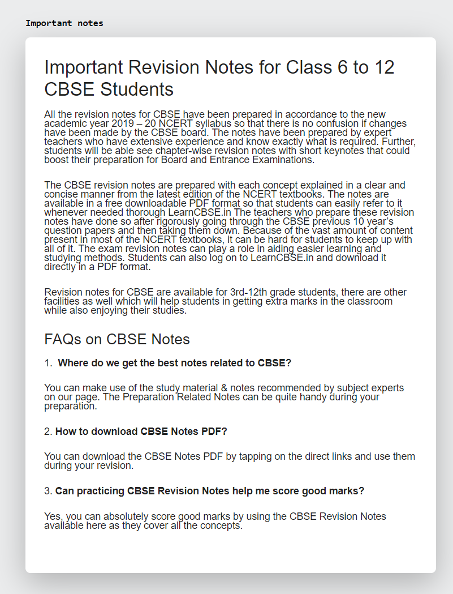

# collabr ✍🏻

Collabr is a collaborative online text edit tool, based on [diff-match-patch](https://github.com/google/diff-match-patch) library.

## Current development state
Supports only one editable in memory document with one page.

## List of To-Do's
- Multi document editing/saving support
- Guaranteed delivery implementation
- User cursor indication for all users on document
- User list on document
- Basic text style support
    - Bold, italic, underline
    - Headers
    - Lists
    - Colored text
    - Links
- Multi page support